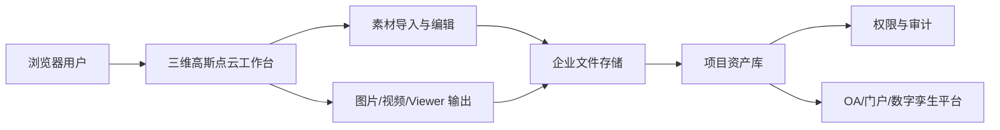

# 基于开源 SuperSplat 的三维高斯点云编辑平台项目介绍书

版本：V1.0  
日期：2026 年 6 月 19 日  
项目暂定名称：SplatForge Enterprise  
文档定位：项目介绍、方案沟通、内部立项与对外展示参考  

## 一、项目概述

本项目是在开源项目 SuperSplat 基础上进行二次开发的浏览器端三维高斯点云编辑与交付平台。项目面向 3D Gaussian Splatting 资产的查看、整理、编辑、清理、格式转换、视频输出和企业化交付需求，旨在为数字孪生、空间扫描、文旅展示、工业可视化、影视预演、房地产展示和教育培训等场景提供轻量、直观、可扩展的三维内容处理工具。

SuperSplat 原项目提供了成熟的浏览器端高斯点云查看与编辑能力。本项目在保留其开源技术基础和核心交互优势的同时，围绕企业实际使用场景进行了增强，包括企业版界面重塑、SPZ 格式支持优化、视频渲染与实时录制、端部精修、区域复制填补、填充选择优化、网格贴地、视口质量控制以及更适合交付场景的本地化发布体验。

项目目标不是简单替换原工具，而是在开源能力之上形成一套更适合企业资产处理流程的三维高斯点云工作台，使用户可以在同一界面中完成素材导入、质量检查、局部编辑、问题清理、格式导出、演示录制和成果交付。

## 二、开源基础与二次开发说明

### 2.1 开源项目基础

本项目基于 PlayCanvas 团队开源的 SuperSplat 项目进行二次开发。SuperSplat 是一个面向 3D Gaussian Splatting 的浏览器端工具，具备以下基础能力：

1. 在浏览器中加载和查看高斯点云资产。
2. 支持点云选择、删除、隐藏、变换和基础清理。
3. 支持多种三维高斯资产格式的导入、导出与压缩。
4. 基于 Web 技术运行，使用门槛低，便于快速部署和演示。

### 2.2 许可证与合规说明

原 SuperSplat 项目采用 MIT License。MIT License 允许复制、修改、合并、发布、分发、再许可和销售软件副本，但要求在软件副本或重要部分中保留原版权声明和许可声明。

因此，本项目作为二次开发版本，在正式对外发布、商业交付或私有部署时，应当：

1. 保留原项目的版权声明和 MIT License 文本。
2. 明确说明本项目为基于 SuperSplat 的二次开发版本。
3. 不暗示本项目获得原开源项目维护方的官方背书，除非已取得明确授权。
4. 对新增代码、品牌、界面、功能和企业化模块进行独立版权归属说明。
5. 对第三方依赖库进行许可证清单梳理，满足企业合规审查要求。

### 2.3 二次开发方向

本项目的二次开发重点包括：

1. 企业化 UI 外壳与品牌表达，降低与原开源界面的相似度。
2. 强化 SPZ 资产导入、导出和查看体验。
3. 增强点云编辑工具，包括端部清理、区域复制、填充选择和画笔选择优化。
4. 增加图片渲染、视频渲染和实时视口录制能力。
5. 优化视口显示质量、网格显示逻辑和场景辅助工具。
6. 建立后续对接企业资产库、权限系统、审计日志和私有部署的扩展基础。

## 三、项目定位

项目定位为“企业级三维高斯点云编辑、清理与交付工作台”。

目标用户包括：

| 用户角色 | 主要需求 | 平台价值 |
| --- | --- | --- |
| 三维内容制作团队 | 快速查看、清理、裁剪、复制和修复高斯点云资产 | 提高资产处理效率，减少工具切换 |
| 数字孪生与信息化团队 | 建立浏览器端三维资产查看和交付能力 | 支持私有部署和企业流程集成 |
| 项目经理与业务团队 | 快速生成汇报图片、演示视频和交付包 | 降低沟通成本，提高项目展示质量 |
| 文旅、地产、工业等行业客户 | 将真实空间扫描成果转化为可展示内容 | 支持高保真场景表达和轻量化分发 |
| 技术集成团队 | 在开源基础上继续扩展企业能力 | 降低研发起点，便于模块化定制 |

## 四、核心功能

### 4.1 多格式三维高斯资产导入与导出

平台支持常见高斯点云资产格式的处理，覆盖不同采集、训练和转换流程的输出结果。

主要能力包括：

1. 支持 PLY、Compressed PLY、SPLAT、SPZ、SOG 等格式。
2. 支持 SPZ v4 与 legacy v3 等版本选择，便于适配不同下游工具链。
3. 支持单个或多个资产导入，便于在同一场景中进行对齐、比较和合并。
4. 支持导出为 PLY、SPLAT、SPZ、SOG 或 Viewer 包，满足编辑、归档、展示和分发需求。

### 4.2 高质量浏览器端查看

平台基于 Web 技术运行，无需安装大型桌面软件即可查看三维高斯点云资产。

增强能力包括：

1. 视口质量调节，支持更高内部渲染分辨率。
2. 飞行模式与环绕模式切换，适配大型室内外场景漫游。
3. 色调映射、背景色、视野角、球谐阶数等显示参数调整。
4. 辅助信息显示控制，包括网格、边界、相机姿态、中心点和选区轮廓。
5. 网格贴地优化，导入 SPZ 后网格可根据可见点云自动估算地面高度，减少网格悬空或穿模问题。

### 4.3 场景管理与基础编辑

平台提供面向三维高斯资产的可视化管理和基础编辑能力。

主要能力包括：

1. 场景管理：查看当前导入素材，控制显示、隐藏、删除和选择。
2. 变换编辑：支持位置、旋转、缩放等空间属性调整。
3. 选择工具：支持矩形、套索、多边形、画笔、填充、盒选、球选等方式。
4. 数据面板：查看点数、选中数量、锁定数量、删除数量及相关属性。
5. 操作历史：支持撤销和重做，降低编辑误操作风险。

### 4.4 填充选择与画笔清理优化

针对高斯点云清理中常见的“选区扩大过度、误删范围过大、镜头移动干扰操作”等问题，项目对选择与填充逻辑进行了优化。

优化方向包括：

1. 填充选择按颜色、透明度和局部连续性进行判断。
2. 降低大范围误选风险，使局部清理更可控。
3. 画笔和填充操作期间阻止相机误移动，提升编辑稳定性。
4. 对空选区和异常选区进行保护，减少误删素材。

### 4.5 端部精修工具

项目新增“端部精修”工具，用于处理高斯点云头尾区域常见的糊边、漂浮点、大尺度点和低透明度噪点。

该工具的设计目标是让用户在删除前先看到候选结果，避免一次性清理范围过大。

主要能力包括：

1. 自动检测低透明度、大尺度和大体积点。
2. 仅作用于当前框选或画笔选区，避免影响整场景。
3. 支持轻度、中度、强力三档清理策略。
4. 支持只清前端、后端或当前视角深度层。
5. 删除前先高亮预览，用户确认后再执行删除。

### 4.6 区域复制到目标位置

项目新增“复制到目标”能力，用于将当前选中的一块点云区域复制到另一个位置，适合修补局部缺失区域、复用相似结构或制作快速场景补全。

典型流程为：

1. 用户先通过画笔、框选或其他选择工具选中源区域。
2. 启动“复制到目标”工具。
3. 在视口中点击目标位置。
4. 系统生成复制资产，并放置到目标区域。

该能力可以用于铺地、墙面修补、结构复用、局部占位和快速演示，但正式交付前仍建议结合人工检查，避免复制痕迹过明显。

### 4.7 图片、视频与实时录制输出

平台支持将三维场景转化为可汇报、可传播、可归档的视觉成果。

主要能力包括：

1. 图片渲染：支持当前视图或指定分辨率导出。
2. 视频渲染：支持分辨率、格式、编码器、帧率、帧范围、码率等参数设置。
3. 实时视口录制：支持直接录制当前浏览器视口中的漫游效果。
4. 录制保护：未导入素材时不启动录制，录制停止后终止相机交互，避免镜头继续旋转。
5. 支持透明背景和调试覆盖控制，便于不同交付用途。

该能力适合客户汇报视频、项目验收材料、投标演示短片、空间漫游宣传片和内部评审记录。

### 4.8 本地 Viewer 与交付包

平台支持导出 Viewer 应用或相关交付包，便于将三维资产交给非技术人员查看。

可用于：

1. 项目成果展示页面。
2. 客户交付包。
3. 内部评审入口。
4. 展厅、会议和路演演示。

后续可在此基础上扩展登录鉴权、项目管理、资产库、访问水印、有效期控制和访问统计。

## 五、技术架构

### 5.1 当前技术基础

当前项目以浏览器端应用为核心，主要技术组成包括：

1. 前端框架与构建：TypeScript、Rollup、SCSS。
2. 三维渲染：PlayCanvas Engine。
3. UI 组件：PCUI。
4. 高斯资产处理：PlayCanvas Splat Transform 相关能力。
5. 视频输出：WebCodecs 与 mediabunny 相关能力。
6. 本地运行：Node.js 与静态文件服务。

### 5.2 推荐企业架构

在企业化落地时，建议采用“浏览器端工作台 + 资产处理服务 + 文件存储 + 企业集成”的整体架构。

推荐模块包括：

1. 前端工作台：负责三维查看、编辑、录制、导出和用户交互。
2. 资产处理服务：负责大文件上传、格式转换、压缩、批处理和任务队列。
3. 项目资产库：负责资产分组、标签、版本、检索和归档。
4. 权限与审计：负责账号、角色、项目权限、访问日志和操作记录。
5. 集成接口：对接企业门户、OA、IM、对象存储、数字孪生平台和内容管理系统。

## 六、应用场景

### 6.1 数字孪生与园区可视化

适用于园区、厂房、楼宇、展厅和城市节点的真实空间扫描成果展示。平台可用于项目汇报、运维培训、空间改造评审和数字孪生底座素材准备。

### 6.2 工业设备与生产现场展示

适用于大型设备、生产线、机房、仓储空间等复杂场景。企业可将现场扫描结果导入平台，进行噪点清理、局部修补、路径录制和交付展示。

### 6.3 文旅、展陈与城市空间传播

适用于景区、博物馆、展馆、历史街区和城市文化空间的沉浸式展示。通过高保真真实场景还原，提升线上宣传、导览介绍和项目招商材料表现力。

### 6.4 房地产与商业空间营销

适用于样板间、商业街区、办公楼宇和特色空间展示。销售团队可快速生成视口录制视频或交互式 Viewer，提高远程看房和方案沟通体验。

### 6.5 影视游戏与虚拟制片预演

适用于真实场景快速入库、分镜预演、镜头路径规划和虚拟拍摄参考。通过时间轴与相机姿态功能，可快速生成镜头预览素材。

### 6.6 教育培训与安全演练

适用于校园实训、设备操作、安全事故复盘和应急演练。企业可基于真实空间资产制作培训视频和交互式课程内容。

## 七、项目价值

### 7.1 降低三维内容处理门槛

项目运行于浏览器环境，减少用户对专业桌面软件的依赖，使业务人员、项目经理和三维设计人员都能参与资产查看、评审和基础调整。

### 7.2 提升真实空间资产交付效率

从导入、清理、调色、裁剪、格式转换到图片、视频和 Viewer 输出，均可在统一界面完成，减少工具切换和重复转码时间。

### 7.3 支持高保真真实场景展示

高斯点云技术适合保留真实采集场景的光照、纹理和空间细节，可用于工业现场、商业空间、文旅景区和建筑室内外等对真实感要求较高的场景。

### 7.4 适配企业私有化和安全要求

项目可部署在企业内网、私有云或专有服务器环境中，减少敏感三维资产外传风险。后续可扩展权限管理、访问审计、文件加密、下载控制和水印能力。

### 7.5 形成标准化交付流程

企业可围绕该平台建立统一的三维资产处理规范，包括导入格式、清理标准、压缩标准、命名规则、视频输出模板、项目归档要求和验收标准。

## 八、部署建议

### 8.1 单机或本地演示部署

适合小团队试用、项目制交付和现场演示。特点是部署简单、成本较低，可快速验证 SPZ 导入、点云清理、视频录制和 Viewer 输出效果。

### 8.2 企业内网部署

适合涉密空间、工厂现场、政府园区、商业项目等不适合公网处理的场景。系统部署在企业内网服务器中，三维资产不出企业边界。

### 8.3 私有云部署

适合多团队、多项目、多地点协作。可结合对象存储、任务队列、权限系统和统一域名入口，形成企业级三维资产处理平台。

### 8.4 平台集成部署

可与企业已有系统集成，包括：

1. 企业门户。
2. OA 审批系统。
3. 项目管理系统。
4. 数字孪生平台。
5. 三维资产管理系统。
6. IM 协作工具。
7. NAS 或对象存储系统。

## 九、安全与合规建议

项目在正式对外发布或企业内部规模化使用前，建议重点关注以下事项：

1. 开源合规：保留 SuperSplat 原项目版权与 MIT License，梳理第三方依赖许可证。
2. 品牌合规：明确二次开发版本的名称、Logo、版权归属和对外宣传边界。
3. 数据安全：对涉密空间、客户现场、工业设施和个人隐私空间建立分类分级管理。
4. 访问控制：后续建议增加账号体系、角色权限、项目隔离和最小权限控制。
5. 操作审计：记录导入、导出、删除、下载、发布和分享等关键操作。
6. 交付审查：正式交付前对压缩质量、格式兼容性、视频输出和 Viewer 包进行验收。

## 十、实施路线建议

### 第一阶段：试点验证

建议周期：1 至 2 周。

主要任务：

1. 部署本地或内网试用环境。
2. 选择 3 至 5 个典型高斯点云资产进行导入测试。
3. 验证 PLY、SPZ、SPLAT 等关键格式兼容性。
4. 验证端部精修、区域复制、填充选择、视频录制和 Viewer 导出。
5. 输出问题清单和优化建议。

### 第二阶段：企业能力增强

建议周期：3 至 6 周。

主要任务：

1. 完成企业品牌化界面和菜单体系整理。
2. 建立项目资产库、分类标签和检索能力。
3. 增加用户权限、项目权限和操作审计。
4. 优化大文件导入、上传和格式转换流程。
5. 建立图片、视频、Viewer 和项目交付包模板。

### 第三阶段：平台化集成

建议周期：6 至 12 周。

主要任务：

1. 对接企业统一身份认证。
2. 对接对象存储、NAS 或私有云文件系统。
3. 对接 OA、项目管理或数字孪生平台。
4. 建设批量处理、任务队列和后台转换能力。
5. 建立日志、监控、告警和备份机制。

## 十一、主要风险与应对

| 风险 | 说明 | 应对建议 |
| --- | --- | --- |
| 大文件性能风险 | 高斯点云资产体积大，可能影响加载和渲染性能 | 建立压缩规范，按场景分级，必要时引入后台转换 |
| 格式兼容风险 | 不同工具输出的 SPZ、PLY、SPLAT 字段可能存在差异 | 建立导入验收集和格式说明 |
| 显示质量风险 | 压缩格式可能带来细节损失 | 按用途选择格式和参数，建立质量验收标准 |
| 浏览器兼容风险 | 视频编码、WebCodecs 等能力与浏览器有关 | 推荐 Chromium 内核浏览器，提供兼容性检测 |
| 数据安全风险 | 三维扫描资产可能包含敏感空间信息 | 采用内网部署、权限控制、审计日志和下载限制 |
| 使用培训风险 | 业务团队对高斯点云概念不熟悉 | 提供标准操作手册、示例项目和培训课程 |

## 十二、总结

本项目基于开源 SuperSplat 进行二次开发，在浏览器端三维高斯点云查看与编辑能力基础上，进一步强化企业 UI、SPZ 支持、视频录制、端部精修、区域复制、填充选择优化和交付输出能力。项目能够帮助企业降低三维资产处理门槛，提高真实空间内容的清理、展示和交付效率，并为后续建设三维资产库、数字孪生平台和企业级空间内容生产体系提供基础能力。

作为二次开发项目，其核心优势在于研发起点高、浏览器端使用门槛低、功能扩展空间大、可私有化部署，并能够根据行业场景继续扩展资产管理、权限审计、批量处理和平台集成能力。

## 十三、发布前建议确认事项

1. 最终产品名称、Logo、版权归属和对外宣传口径。
2. 是否继续使用 SplatForge Enterprise 作为企业版名称。
3. 目标客户行业、重点应用场景和演示案例素材。
4. 是否需要增加私有化部署、SSO、权限、审计和资产库模块。
5. 是否需要补充性能指标，例如最大资产规模、推荐显卡、加载时间和视频输出规格。
6. 是否需要由法务完成开源许可证、第三方依赖和商用发布合规审查。

本介绍书涉及对外宣传、开源合规、数据安全和企业交付边界等事项，正式用于商务投标、客户材料或公开发布前，建议由产品、技术、法务和商务负责人共同复核。
